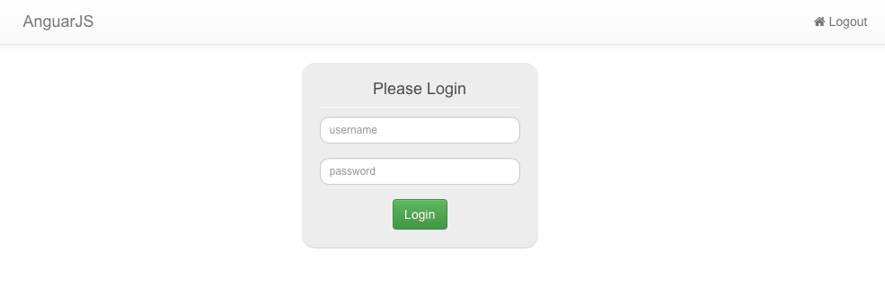
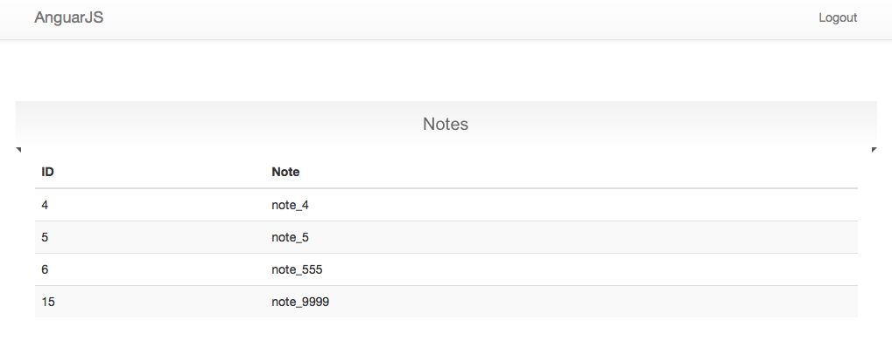
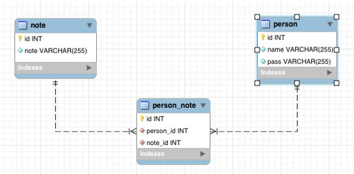

# Website, AngularJS , PHP

A simple Website with the Login page. The system cooperates with MySQL databases.

Back end:

* The database that will store notes and users.  
* The website that allows visitors to register or log in. If they are logged in, display a form
and display the notes per particular user.
* The note is loaded with a little delay asynchronously.  

In this assignment I used:

```
* MySQL
* AngularJS
* PHP
* HTML
* CSS
* JavaScript, jQuery, AJAX
```

## Screenshots

<p align="center">
  
</p>


<p align="center">
  
</p>

## ER diagram, MySQL Database

<p align="center">
  
  
</p>